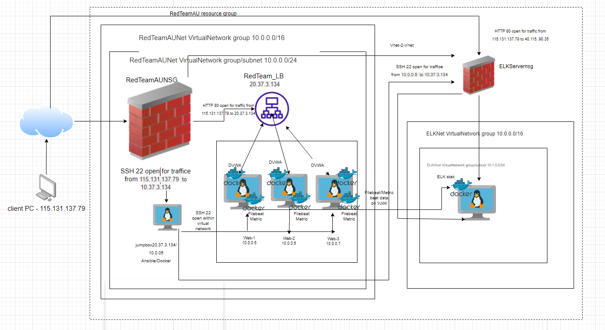
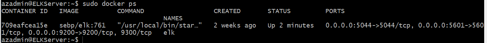
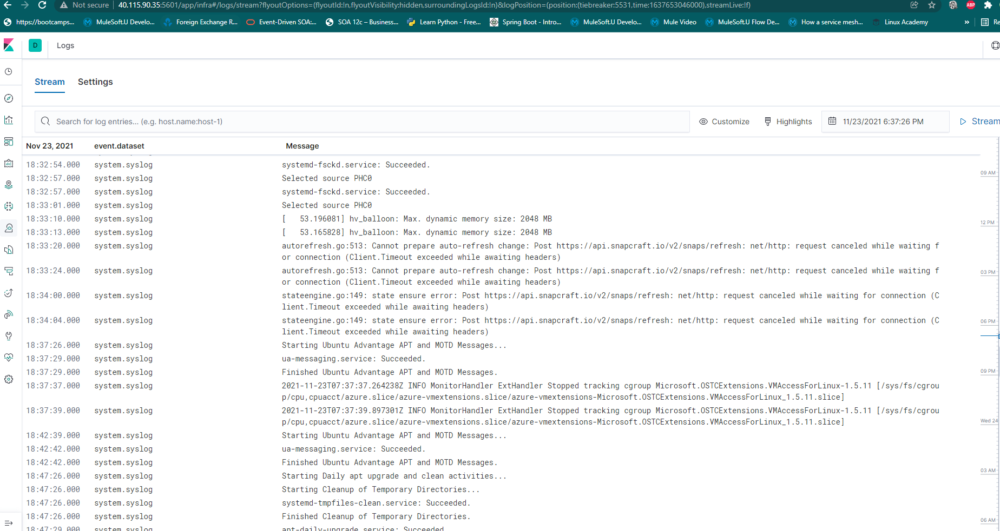
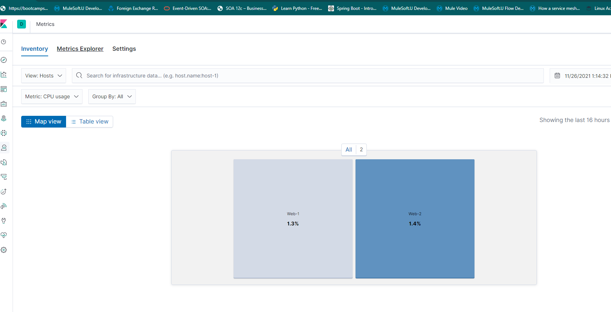

## Automated ELK Stack Deployment

The files in this repository were used to configure the network depicted below.

These files have been tested and used to generate a live ELK deployment on Azure. They can be used to either recreate the entire deployment pictured above. 

- [DVWA Install](Ansible/ansible_playbook.yml)
- [ELK Install](Ansible/install_elk.yml)
- [Filebeat Install](Ansible/filebeat-playbook.yml)
- [Filebeat Agent install](Ansible/filebeat-playbook.yml)
- [Metricbeat Agent Install](Ansible/metricbeat_playbook.yml)

## This document contains the following details
- Description of the Topology
- Access Policies
- ELK Configuration
- Beats in Use
- Machines Being Monitored
- How to Use the Ansible Build

## Description of the Topology

The main purpose of this network is to expose a load-balanced and monitored instance of DVWA, the D*mn Vulnerable Web Application.

Load balancing ensures that the application will be highly available, in addition to restricting access to the network.

Load balancer provides external IP address for clients to connect from Internet instead of exposing the web application servers directly to Internet.
Load balancer provide distributed traffic evenly across servers and mitigates DoS attacks.  

Integrating an ELK server allows users to easily monitor the vulnerable VMs for changes to the wep application server logs and system logs.

**Filebeat** is a lightweight shipper for forwarding and centralizing log data. Filebeat agents installed on VMs monitor the log files or locations that are configured while installing the agent on VMs, collects log events, and forwards them either to Elasticsearch or Logstash for indexing.

**Metricbeat** collects the data for CPU, memory, fileIo, network stats and metric for application servers like apache, mysql

The configuration details of each machine may be found below.

| Name       | Function 				| IP Address | Operating System |
|------------|--------------------------|------------|------------------|
| Jump Box   | Gateway  				| 10.0.0.5   | Linux            |
| Web-1      | Web server for DVWA   	| 10.0.0.6   | Linux            |
| Web-2      | Web server for DVWA   	| 10.0.0.7   | Linux            |
| Web-3      | Web server for DVWA   	| 10.0.0.8   | Linux            |
| ELK Server | ELK server Host       	| 10.0.0.6   | Linux            |

### Access Policies

The machines on the internal network are not exposed to the public Internet. 

Only the jumpbox machine can accept connections from the Internet. Access to this machine is only allowed from the following IP addresses:
- _115.131.137.79_

Machines within the network can only be accessed by jump box.
Jump box is only allowed to access Web-1/2/3 & ELK server
Jumpbox IP address
- _PrivateIP: 10.0.0.5_
- _PublicIP: 20.37.7.44_

A summary of the access policies in place can be found in the table below.

| Name     | Publicly Accessible 		| Allowed IP Addresses 				  |
|----------|----------------------------|-------------------------------------|
| Jump Box | Yes (ssh 22)          		| 115.131.137.79       				  |
| Web-1    | No                  		| 10.0.0.5(Jumpbox) & LB - 20.37.3.134|
| Web-2    | No                  		| 10.0.0.5(Jumpbox) & LB - 20.37.3.134|
| Web-3    | No                  		| 10.0.0.5(Jumpbox) & LB - 20.37.3.134|
| ELK      | No (port 5601 for public)  | 10.0.0.5(Jumpbox)                   |
| ELK      | HTTP API - 9200 - Yes      | 10.0.0.0/16                         |

### Elk Configuration

Ansible was used to automate configuration of the ELK machine. No configuration was performed manually, which is advantageous because...
The main advantage of automating configuration with Ansible is avoidance of manual errors while configuring and easy deploy on new servers.

The playbook implements the following tasks:
- set virtual memory max_map_count to 262144
- Install docker 
- Install python
- Download and install ELK Docker container
- Docker is started when VM restarts

The following screenshot displays the result of running `docker ps` after successfully configuring the ELK instance.

### Target Machines & Beats
This ELK server is configured to monitor the following machines:

| Name       | Function 				| IP Address |
|------------|--------------------------|------------|
| Web-1      | Web server for DVWA   	| 10.0.0.6   |
| Web-2      | Web server for DVWA   	| 10.0.0.7   |
| Web-3      | Web server for DVWA   	| 10.0.0.8   |

Installed the following Beats on these machines:

| Name       | Function 				| BeatAgents 			|
|------------|--------------------------|-----------------------|
| Web-1      | Web server for DVWA   	| Filebeat, Metricbeat  |
| Web-2      | Web server for DVWA   	| Filebeat, Metricbeat  |
| Web-3      | Web server for DVWA   	| Filebeat, Metricbeat  |

These Beats allow us to collect the following information from each machine:

Filebeat - Collects data from system file logs and server logs
- Sample data
	

Metricbeat - Collects system data such as uptime, cpu/memory usage
- Sample data
    

### Using the Playbook
In order to use the playbook, you will need to have an Ansible control node already configured. Assuming you have such a control node provisioned: 

SSH into the control node and follow the steps below:
 Copy the install_elk.yml file to /etc/asnible/roles/install_elk.yml.
- Update the hosts file to include elk server ip

- Run the playbook, and navigate to http://40.115.90.35:5601/app/kibana#/home to check that the installation worked as expected.

 **Bonus**, provide the specific commands the user will need to run to download the playbook, update the files, etc
 
 On jumpbox run curl commad to get the yom file as follows
 
 curl -O -L https://github.com/malladisastry/malladisastry/blob/main/Ansible/install_elk.yml 
 
 Update host file with ELK server ipaddress in /etc/ansible/hosts file
[elk]
< elk ip address>  ansible_python_interpreter=/usr/bin/python3

Run playbook as follows
ansible-playbook install_elk.yml

Navigate to http://<elk server ip address>:5601/app/kibana#/home to ensure that Kibana page is accessible

